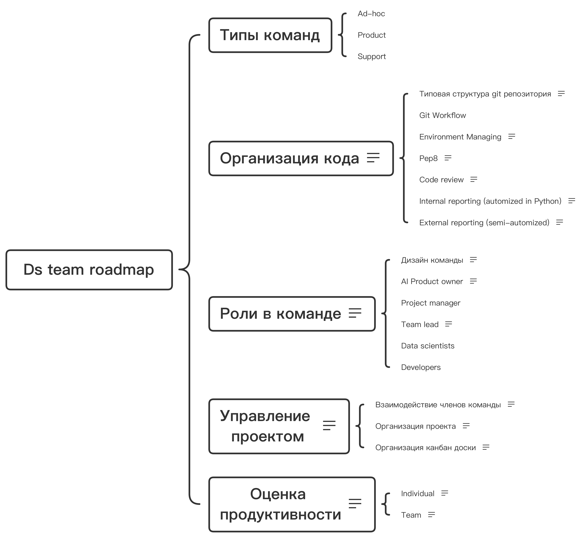

# DS-team-roadmap

#### Как мы проверяем и оцениваем гипотезы в YouDo, Адам Елдаров, Head of Product and Data Science
https://www.youtube.com/watch?v=jmjzSor1WDU
>Как организовать DS в компании, какие варианты построения команд есть, как фокусировать команду на самом важном, проверять гипотезы и как оценивать их эффективность для бизнеса.

## Типы команд

- Ad-hoc
- Product
- Support

## Организация кода
Система организации кода и связанной с ним технической части проекта.  

### Типовая структура git репозитория
#### Описание
Структура репозитория для унификации, прозрачности работы и упрощения переключения между проектами для всех участников команды и сотрудников компании.

#### Ссылки
>https://github.com/YKatser/ml-project-template

### Git Workflow
#### Описание
1. Для каждого изменения в мастер или при проверке очередной гипотезы создается отдельная ветка, в которой эти изменения вносятся и гипотезы проверяются. В случае успеха отправляется pull request для дальнейшего рассмотрения и возможного мерджа с мастером.
2. Code review и hypothesis check review проводятся на этапе отправки pull request, и при успешном review ветка мерджится с мастером.
3. Каждая ветка предназначена для одной гипотезы, небольших (не более 3х человекодней работы) изменений и соответствует тикету в jira. Поэтому название ветки рекомендуется брать из названия карточки в jira.
4. При подготовке pull request НЕОБХОДИМО писать комментарий с кратким описанием изменений, при проверке гипотез можно дополнительно добавлять ридми, где отображать метрики/графики ([пример](https://www.youtube.com/watch?v=9BgIDqAzfuA)).

#### Ссылки
>https://github.com/dslp/dslp/blob/main/branching/branch-types.md#experiment-branches  
>[Курс MLRepa](https://ml-repa.ru/reproducibility-pipelines-automation-mlops)

### Environment Managing
#### Описание
Для обеспечения воспроизводимости важно использовать requirements.txt, инициализируя файл в самом начале проекта.
Управление зависимостями помогает управлять всеми библиотеками, необходимыми для работы приложения.
Можно как использовать виртуальное окружение (приоритетный вариант), так и работать с ноутбуками в контейнере.

#### Ссылки
>[Creating Virtual Environments and Managing Packages with pip](https://docs.python.org/3/tutorial/venv.html)  
>[Add Virtual Environment to Jupyter Notebook/Juplab](https://janakiev.com/blog/jupyter-virtual-envs/)

### Pep8
#### Описание
Единый стандарт написания кода для унификации стиля написания кода и упрощения чтения кода.
    
#### Ссылки
>https://pep8.org  
>https://gist.github.com/RichardBronosky/454964087739a449da04 - pep8 cheat sheet (short)

### Code review
#### Описание
Проверка исходного кода на ошибки, проблемы постановки эксперимента.

#### Ссылки
>https://tlroadmap.io/roles/technical-lead/product-quality/code-review.html  
>https://mtlynch.io/human-code-reviews-1/  
>https://mtlynch.io/human-code-reviews-2/  
>https://youtu.be/2F6J82-Ch88

### Internal reporting (automized in Python)
#### Описание
Заполнение документов о результатах проверки гипотез, а также внутренние отчеты (по работе моделей и тд).
Процесс должен быть унифицирован и автоматизирован в начале или до начала очередного проекта.
    
#### Ссылки
>[Пример отчета](https://drive.google.com/file/d/1jahPaEie6T4hBrun4HkysXqibxntjkV_/view?usp=drivesdk)

### External reporting (semi-automized)
#### Описание
Внешний отчеты для заказчика/клиента/контролирующих органов. Могут составляться по гостам, по форме, согласованной до начала/в процессе проекта, в свободной форме.

#### Ссылки
>Пример отчета

## Роли в команде
Система организации команды.

### Дизайн команды
#### Описание
Актуально и для единой структурной единицы (лаборатории, отдела), и для проектной команды, работающей над одним бэклогом.
У каждой роли свой список обязанностей (должностная инструкция) и свой круг ответственности. 
Обязанности и ответственность могут меняться в зависимости от проекта и этапа проекта.

- Responsibility assignment matrix:

    
#### Ссылки
>https://tlroadmap.io/roles/people-manager/team-management/team-design.html

### AI Product owner
#### Описание
- Мост между бизнесом и DS.
- Понимание возможностей и ограничений DS.
- Полномочия принятия решений.
- Ответственность за результат с точки зрения бизнеса и потребителя.

#### Ссылки
    todo

### Project manager

### Team lead
#### Описание
Team lead - связь между продукт менеджером/продукт овнером и членами DS команды/команды разработки. 
Может совмещать роли продукт менеджера, проджект менеджера.
    
#### Ссылки
>Team lead roadmap – это карта навыков и компетенций тимлидов, которую можно адаптировать для любой компании и команды:  
>https://github.com/tlbootcamp/tlroadmap

### Data scientists

### Developers

## Управление проектом
Система организации проектной деятельности.

### Проработка проекта в начале
- AI canvas
>[Как мы используем AI Канвас в БигДате МТС, Мария Ракитина, менеджер продуктов МТС](https://www.youtube.com/watch?v=frtCsg8tPp4)  
>[The Ultimate AI Canvas](https://www.youtube.com/watch?v=hTR66u0i1Qo)

- Check list

- customer journey map

### Взаимодействие членов команды
#### Описание
Планируемые встречи (взаимодействие команды): 
- Брейнстормы - для наполнения бэклога и определения архитектуры решения (раз в 2 недели)
- Стендапы - для обеспечения прозрачности и выявления рисков/проблем (ежедневно, через день)
- Ретроспективы (ретро) - для настройки процесса и понимания слабых мест (раз в 2 недели)

#### Ссылки

### Организация проекта
#### Описание
Система, описывающая все процессы взаимодействия с внешними и внутренними лицами и исполнителями.
    
#### Ссылки
>[Team Data Science Process (TDSP)](https://docs.microsoft.com/ru-ru/azure/machine-learning/team-data-science-process/lifecycle-data)  
>https://youtu.be/HJML5Ghz-hk

### Организация канбан доски
#### Описание
Канбан доска создаётся на основе болей и проблем команды, чтобы она была вспомогательным инструментом в работе и в обеспечении качества проекта.
    
#### Ссылки
>https://www.youtube.com/watch?v=QYkuv2zuCFk

## Оценка продуктивности
Оценка личной и командной продуктивности. 
Процесс может быть выстроен как регулярный анализ и разбор метрик продуктивности (пример команды) или как регулярные performance review (пример члена команды).

### Individual
#### Описание
Оценка эффективности членов команды чаще всего проходит с помощью регулярных performance review. 
Performance review - это инструмент измерения эффективности члена команды.

Как часто:
- По времени (раз в квартал)
- По проектам (после каждого крупного проекта)

Дополнительно использовать one-on-one Тим Лида с каждым членом команды, чтобы рассказать результаты ревью, собрать обратную связь, а также обсудить вопросы, которые лучше не выносить на публику.

#### Ссылки
>[Performance review](https://youtu.be/HKXJ_AWPVBA)  
>[One-on-One 1](https://github.com/YKatser/DS-links/blob/master/TeamLeadLectures.md#георгий-могелашвили-bookingcom-эффективные-1-на-1)  
>[One-on-One 2](https://github.com/YKatser/DS-links/blob/master/TeamLeadLectures.md#встречи-one-on-one-инструмент-эффективного-управления-сотрудниками-никита-бакунин)

### Team
#### Описание
Оценка эффективности команды. Можно через ttm и другие продуктовые метрики.
    
#### Ссылки
>https://youtu.be/c0CRiCeJ99s
